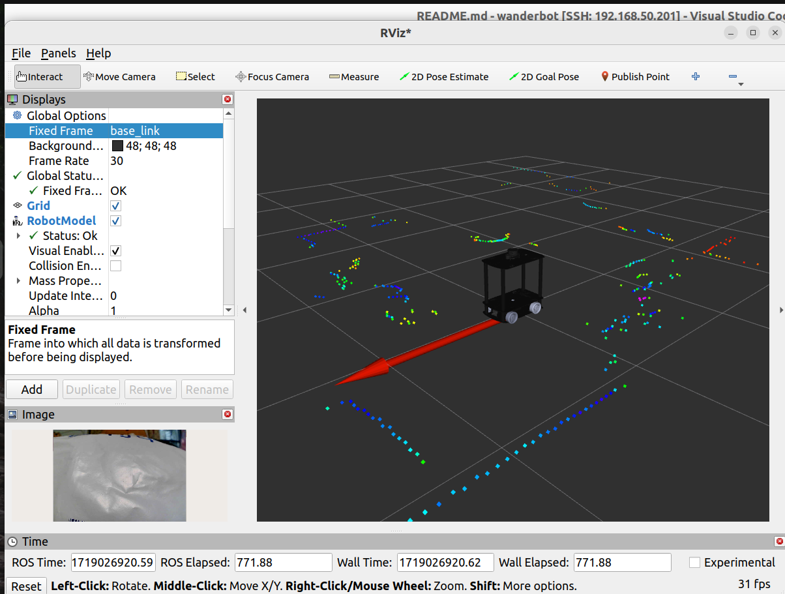
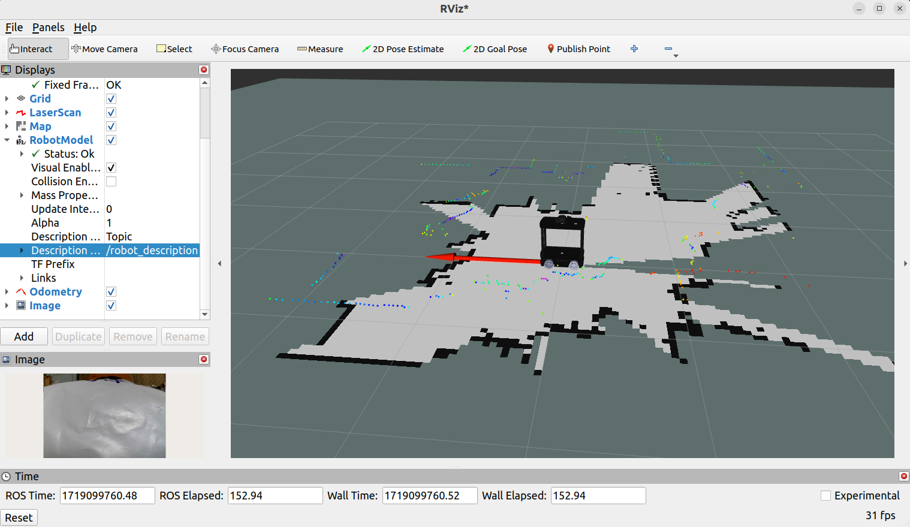
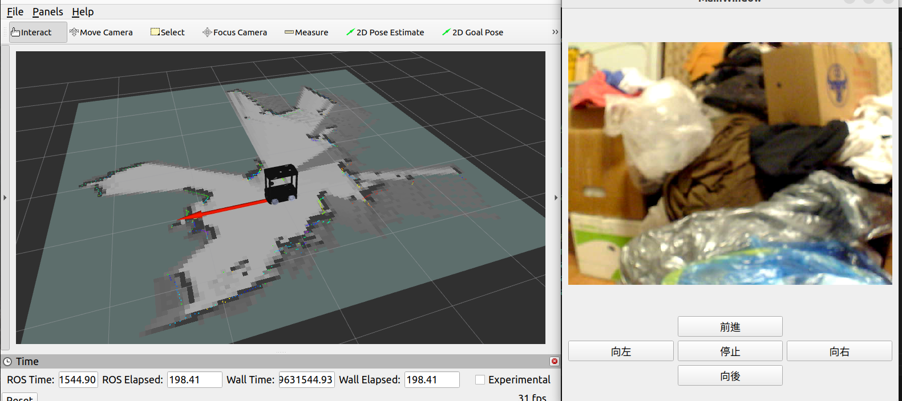

# wanderbot

### **my ROS2 robot car project**

2024/06/15

## 1.底盤測試

#### 機器人端

````bash
ros2 launch ros2_stm32_bridge driver.launch.py
````

#### 本機端

```bash
rviz2
```

---

## 2. 機器人 URDF 顯示於 RViz2

#### 機器人端

```bash
ros2 launch wanderbot4W_description wanderbot.launch.py
```

#### 本地端

```bash
rviz2
```

- 選擇 `base_link`
- Add `robotModel` -> `robot_descrption`

---

## 3. 相機測試

#### 機器人端

```bash
ros2 run usb_cam usb_cam_node_exe --ros-args --params-file /home/sunrise/wanderbot/src/wanderbot_integrate/camera_config/usb_cam.yaml
```

#### 本機端

```bash
rviz2
```

---

## 4.底盤測試

#### 機器人端

```bash
ros2 launch ros2_stm32_bridge driver.launch.py
```

#### 本機端

```bash
rviz2
```

```bash
ros2 run teleop_twist_keyboard teleop_twist_keyboard
```

---

### 5. Ｎ10激光雷達

#### **機器人端**

```
ros2 launch lslidar_driver lsn10_launch.py
```

#### 本機端

````
rviz2
````

---

## 6. 整合（相機/雷達/底盤）

#### 機器人端

```
ros2 launch wanderbot_integrate wanderbot_integration.launch.py
```

#### 本機端

```
rviz2
```



---

## 7. slam gmapping建圖

#### 機器人端

```
ros2 launch wanderbot_integrate wanderbot_integration.launch.py
```

```
ros2 launch wanderbot_slam_gmapping gmapping.launch.py
```

#### 本地端

````
rviz2
````

```
ros2 run control_simulate control_sim

```

或者

```
ros2 run control_simulate control_sim
```



### 儲存地圖

```
ros2 run nav2_map_server map_saver_cli -f src/maps/my_room
```

## 8. Catographer建圖

#### 機器人端

```
ros2 launch wanderbot_integrate wanderbot_integration.launch.py
```

```
ros2 launch wanderbot_cartographer cartographer.launch.py
```

### 本機端

```
rviz2
```

```
ros2 run control_simulate control_sim
```

### 儲存地圖

```
ros2 run nav2_map_server map_saver_cli -f src/maps/my_room
```



## 9. 導航

#### 機器人端

```
ros2 launch wanderbot_integrate wanderbot_integration.launch.py
```

```
ros2 launch wanderbot_nav2 nav2_bringup.launch.py
```

#### 本地端

```
rviz2
```

